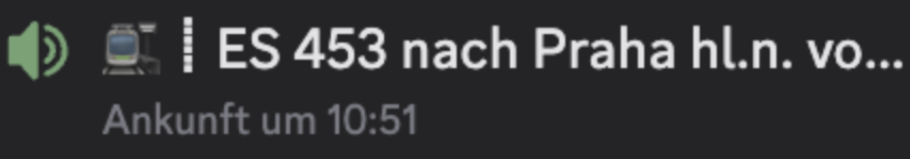
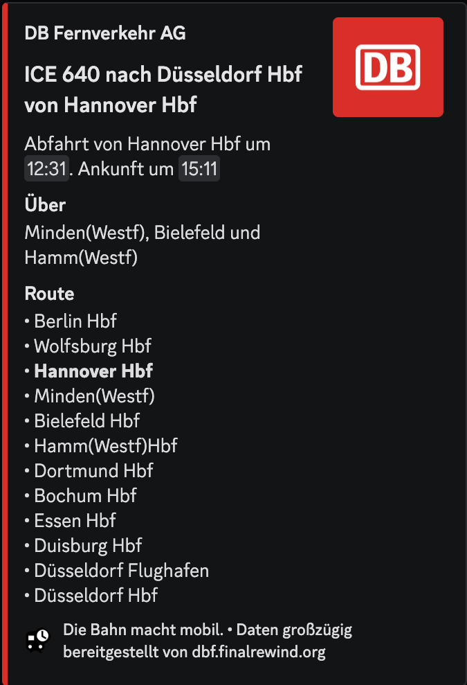
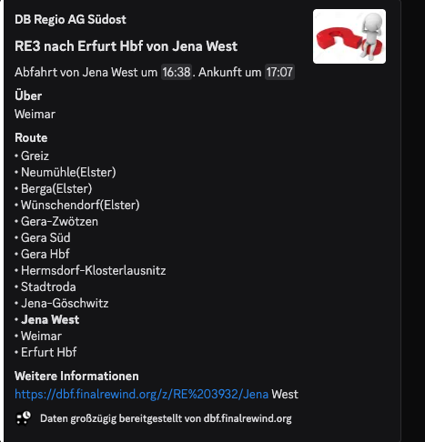

# Gleiswechsel
Gleiswechel ist ein Discord Bot, welcher einen Sprachkanal zu einer real-existierenden, aktuell befahrenden Zugverbindung umbenennt. Diesen Namen behält der Kanal so lange, wie die Verbindung in echt dauert.  

 

Der Bot stellt außerdem den `/info` Befehl dar, welcher einem weitere Informationen zur Verbindung zurückgibt  



## Setup
```sh
git clone https://github.com/kaaninchen/Gleiswechsel.git

# Mit Python
python -m venv venv 
source venv/bin/activate
pip install -r requirements.txt 

# Mit uv
uv venv venv
source venv/bin/activate
uv pip install -r requirements.txt

```

### Config

`$ cp config.json.example config.json`
```jsonc
{
    "token": "", // Token des Bots
    "stations": [ "Berlin Hbf", "Hamburg Hbf", "München Hbf", "Amsterdam Centraal"], // Bahnhöfe, von denen die Anzeigetafelns gelesen werden. Namen kann man auf https://dbf.finalrewind.org/ nachschlagen.
    "dbf": "https://dbf.finalrewind.org", // Die DBF Instanz. Normalerweise müsste man hier nichts ändern
    "server": , // Discord Server ID
    "vc": , // Server VC ID
    "random": true, // Random Zug aus der Anzeigetafel (true) oder erster Zug, der angezeigt wird (false)
    "emojis": true, // Emoji Namen beim Channel-Namen (true) oder nicht (false)
    "formatting": "┇", // VC Name. Davor steht der Emoji, danach der Zug.
    "blacklist": [] // Blacklist für bestimmte Zug-Typen
}

```

<details>
<summary>weitere Config Erklärungen</summary>

#### dbf:
Falls, aus irgendwelchem Gründen, man nicht die [offizielle DBF Instanz](https://dbf.finalrewind.org) nutzen möchte, hat man die Möglichkeiten seine eigene zu hosten. Instruction dazu gibts auf dem [zuständigen Repo](https://github.com/derf/db-fakedisplay). Dafür kann man das Feld in der config mit der eigenen URL austauschen. 

#### random:
Bei kleineren Bahnhöfen stehen an den Anzeigetafeln öfters die Züge lange vor Abfahrt da, weil sonst der Bahnhof leer steht. Dadurch wird auch der Name des VC sehr lange gleich bleiben.   
Sollte man `random = false` setzen, würde immer der erste Zug an der Anzeigetafel genommen werden, welcher auch der wäre welcher am frühesten losfährt. Wenn man viele Bahnhöfe hat besteht darin keine Gefahr. 

Wenn man nur einen Bahnhof hat ist es stark empfohlen random zu nutzen. Sonst könnte der Bot bei unvollständigen Einträgen in einer Schleife immer wieder vergeblich den selben unvollständigen Zug probieren.

#### blacklist:  
Die Blacklist ist dafür gedacht, ganze Zugtypen zu ignorieren. Beispielsweise möchte man, dass der Bot keine ICE's, keine NightJets und keine European Sleepers auswählt, da diese sehr lange Strecken fahren und der VC somit lange unverändert bleibt:
```json
{
    ...
    "blacklist": [
        "ICE",
        "NJ",
        "ES"
    ]
}
```  

Die Namen der einzelnen Zugtypen kann im Footer von `/info` oder im Terminal log erfahren.

## src/data 
Es kann vorkommen, dass während dem `/info` Befehl das Logo und die Farbe des Bahnuntermehns fehlt.

  

Die zugehörigen Daten lassen sich innerhalb [src/data/operators.py](src/data/operators.py) ergänzen. Der Aufbau dabei sollte selbsterklärend sein, dennoch habe ich eine kleine Beschreibung in die Datei hinzugefügt. Bei Änderungen sind PR's willkommen.  

Emojis für die Formattierung werden dynamisch anhand des Zugtypens gepulled. Dabei wird zwischen Nahverkehr und Fernverkehr unterschieden. Bei einem Zugtyp, welcher zu keiner der Kategorie assigned ist, wird ein Fallback Emoji eingesetzt. Sollte man einen Zugtypen hinzufügen wollen oder die Emojis ändern/deaktivieren wollen ist dies in [src/data/emojis.py](src/data/emojis.py) möglich. Die Namen der einzelnen Zugtypen kann im Footer von `/info` oder im Terminal log erfahren.

Den Status, den sich der Bot alle 5 Minuten random auswählt, kann man in [src/data/status.py](src/data/status.py) anpassen.

</details>

### Running

```sh
# Python
python main.py
# ODER
python3 main.py

# uv
uv run main.py
```

## Bekannte Bugs
#### Stuttgart in Berlin
Ich weiß nicht ganz wieso, aber die API vertauscht manchmal die S-Bahn von Berlin mit der S-Bahn von Stuttgart. Es scheint eher ein Upstream-Issue zu sein, weswegen ich da leider mit dem Bot nicht viel ändern kann.   
Der Bug führt dazu, dass bei manchen S-Bahn Verbindungen `DB Regio AG S-Bahn Stuttgart` als Betreiber der Berlin S-Bahn angezeigt wird. Außerdem gibt die API dem Bot die Ankunftszeiten einer S-Bahn Verbindung von Stuttgart wieder, während die Route von der aus Berlin stammt (Die Route und die Ankunftszeiten werden von zwei verschiedenen Endpoints gepulled: Route: `{dbf}/Berlin%20Hbf.json`, Ankunftszeit: `{dbf}/z/S%20{ID}/Berlin Hbf.json`).  
Falls das einem zu sehr stört kann man S-Bahns auf die Blacklist packen.   

```json
{
    ...
    "blacklist" = [
        "S "
    ]
}

```

Allgemein scheint der Berlin HBF eine sehr komische Station zu sein. Die meisten Bugs beim Testing kommt von dieser. Falls jemand mehr weiß sind PR's wie immer willkommen