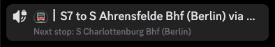
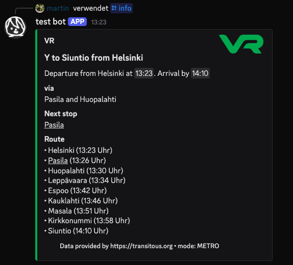
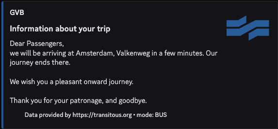

# Gleiswechsel
Gleiswechsel [ˈɡlaɪsvɛksəl] (german for "platform change") is a selfhostable discord bot which regularly changes the name of a voice chat to a real public transport connection. The channel will keep the name until the connection arrived at its last stop, after that it will automatically select a new one.



## Features
- [International support](https://transitous.org/sources/) for countries as well as cities
- Support for various types of transportations, including but not limited to Subways, Busses, Funiculars, Trams and Trains
- Multi language support (+ option to easily add more languages)
- Announcements, including the option to join the voice chat and play an audio file while arriving at a specific station
- Highly customizable
- pretty `/info` embed with some details about your current ride



## Setup
Follow [this guide](https://guide.pycord.dev/getting-started/creating-your-first-bot) to create your discord bot up until you have a token. 

Make sure that you have [Python](https://www.python.org/) installed! 

Download the repo (either with git or by clicking the big "Code" button at the start on this page, downloading the zip and extracting it) and run:

```sh
# Create a virtual environment so that the bot won't cluster your system with dependencies
python -m venv venv

# Activate your venv, you should have gotten instructions after running the first command, e.g.:
source venv/bin/activate

# Install the required dependencies
pip install -r requirements.txt
```

Next, you should configure the bot to your liking

## Config
Even if it seems a bit tedious, I highly recommend going through the entire config and checking if there's something that you would like to customize.  

I added an [example config](config.json.example). Rename `config.json.example` to `config.json` and fill it out.

### Config explanations

#### discord

- `"token"` is for the discord bot token. You should have copied it earlier

- `"server"` and `"vc"` are the ID's for the server and the voice chat that the bot should use. Follow [this guide](https://support.discord.com/hc/en-us/articles/206346498-Where-can-I-find-my-User-Server-Message-ID) to get them.

- `"lang"` is for the language that the bot should use within discord. The relevant language files are located in [src/data/locales/](src/data/locales). Current available languages are english ("en") and german ("de"). Feel free to add your language if you miss it! 

- `"formatting"` and `"emojis"` are for the channel name. Set `emojis` to `False` and `"formatting"` to `null` if you just want the connection as the channel's name without any decor.

#### connections

##### stations
You can add your desired stations that the bot should search connections from there. The bot will choose one of the stations at random. 

The bot will also search for similar named stations if it couldn't find an exact match to your input. This is really handy if you'd just like to ride around in a city with various stations. For example, if you just input "Amsterdam" as a station, the bot would randomly choose one of these stations:

```json
"Amsterdam": [
    "Amsterdam Zuid",
    "Amsterdam RAI",
    "Amsterdam Amstel",
    "Amsterdam, Gein",
    "Amsterdam Centraal",
    "Amsterdam, Noord",
    "Amsterdam, Rokin",
    "Amsterdam Lelylaan",
    "Amsterdam Sloterdijk"
]
```

The bot will also warn you if it couldn't find a station with the exact name as your input:

```
22:44:46: INFO: No station associated as 'Amsterdam', choosing random from similar named stations
```

but you can safely ignore this warning if you're fine with it. 

If not, I've created a tool which would help you to get the exact station name. You can use the tool by running

```sh
$ python main.py stations
```

Example output:
```json
    "stations": {
        "Amsterdam": [
            "Amsterdam Zuid",
            "Amsterdam RAI",
            "Amsterdam Amstel",
            "Amsterdam, Gein",
            "Amsterdam Centraal",
            "Amsterdam, Noord",
            "Amsterdam, Rokin",
            "Amsterdam Lelylaan",
            "Amsterdam Sloterdijk"
        ],
        "Berlin": [
            "Berlin Hbf",
            "Berlin ZOB",
            "Berlin Ostbf",
            "Berlin-Spandau",
            "Berlin Südkreuz",
            "U Rudow (Berlin)",
            "S Buch (Berlin)",
            "U Hönow (Berlin)"
        ]
      }
```

The tool will also ask if it should save a .json file with more informations for every similar station. If you're unsure about what which station is, then it can be really helpful! It would give you data like which types of transports arrive at every similar station, in which country they are and also their coordinates. 

If you choose to generate the json, then you'll find the file as `stations.json` in the same directory as `main.py`

##### IDs
For every station inside of the `stations.json` you'll find an ID. You can add that ID to `"IDs"` to really specify that you would like to use THAT station, and not a different one.

This is especially useful if you want to add a station whose name isn't unique and also used by other stations. The bot would falsely use the first station with the same name and consider it an exact match, even if you wanted a different one. This won't happen with the ID, as every ID is uniquely assigned to only one station.

##### priority
You can define priorities of transport modes while selecting a connection. Leave empty to disable   

The list should be descending, with "1" as the most important transport mode. For example, let's say, the bot should always choose Trains and other longer distance public transport modes. If it can't find any, then it should resort to Metros/Subways/Suburbans. If these are also missing at that station, then it should just use Busses/Trams:

```json
"priority": {
    "HIGHSPEED_RAIL": 1,
    "LONG_DISTANCE": 1,
    "NIGHT_RAIL": 1,
    "REGIONAL_RAIL": 1,
    "COACH": 1,
    "FERRY": 1,
    "METRO": 2,
    "SUBURBAN": 2,
    "SUBWAY": 2,
    "BUS": 3,
    "TRAM": 3
}
```
A transport mode that isn't in the priority list would immediately get assigned the value of "99", making it near impossible to get that connection. Except when there are no other connections available, of course.

You can find the MODE names either in the console log or the stations.json from [helper tool](#stations)

##### blacklist
You can blacklist specific types of transport, the bot would then skip them while selecting a connection. You can get the type in your console (mode)
```sh
22:44:47: INFO: Agency: GVB, mode: TRAM
```

I highly recommend keeping `"OTHER"` blacklisted, if the API doesn't know what that is then we probably shouldn't use it. Also, it would probably a good idea to keep `"RIDE_SHARING"` blacklisted as they have weird timetables

##### min_duration, max_duration, max_wait_time, timezone

- `min_duration` is the minimal duration of the connection in minutes. It is HIGHLY recommended to set it to atleast 10, as discord only allows to change the name of a voice chat twice every 10 minutes.

- `max_duration` is the maximun duration of the connection in minutes. Set to `null` to disable

- `max_wait_time` is the maximun wait time for a connection in hours. Don't set that one too low, as the bot may have some issues finding a suitable connection at night, or at stations that aren't frequently used. Set to `null` to disable

- `timezone` is timezone in the IANA timezone format. You can [look it up here](https://www.addevent.com/c/documentation/tools/time-zone-lookup)

##### announcements

##### `text_announcements:`
The bot can send a text announcement in the voice chat at the start/end of a trip. 
At the end of a trip, it would send this embed:



It will also send the `/info` embed at the start of a new connection with informations about your new trip.

To reduce spam, the bot will only send announcements if someone is in the voice chat

##### `voice_announcements:`
The bot can join the voice chat, play an audio file, and disconnect from the voice chat, at various points of your trip. You have to have [FFmpeg](https://www.ffmpeg.org/) installed for this to work.

Place the audio file of your desired station in [src/data/announcements](src/data/announcements/) with the EXACT name of the station. The bot will automatically check if an audio file with the stations name exists, and if it does, play it. 

You don't have to restart the bot after placing new audio files in the folder.

#### `map:`
The bot can generate a map of your route in the `/info` embed. Set `map` to `true` to enable. 

#### http

- `"user_agent"`: The user agent of the bot for the API. If you don't know what that is, then you shouldn't have to change that. Modify the contact URL (in my case, the github repo) if you change a lot of the code, so that transitous can contact you in case of any issues

## Running
After you've set everything up, you're ready to start the bot!

```sh
$ python main.py
```

## src/data
[src/data](src/data/) contains a few files/directories which may be interesting to customize. 

### [emojis.py](src/data/emojis.py)
if `emojis` is enabled in the config, the bot will use that file to determine the right emoji for the voice chats name according to the current mode. You can add missing modes there or customize the emojis

### [operators.py](src/data/operators.py)
Metadata for the `/info` embed. You can assign an agency a logo, color and (optionally) some slogans. The agency name is visible in the console log and the `/info` embed.

If multiple agencys should use the same metadata, take a look at OPERATOR_ALIASES. 

You don't have to restart the bot after editing this file.

### [locales/](src/data/locales/)
Covered in [locales](#locales)

### [announcements/](src/data/announcements/)
Covered in [voice announcements](#voice)

### [assets](src/data/assets/)
Assets (such as images) which the bot uses. You shouldn't have to change anything there